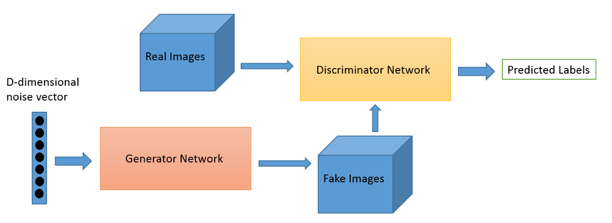
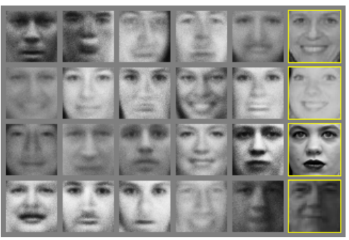
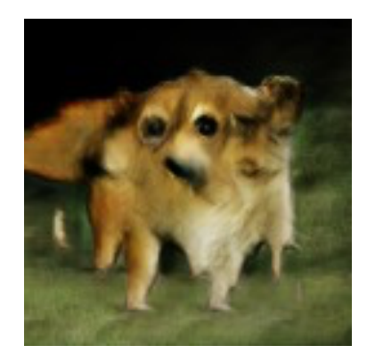

# Generating and Labeling Images with TF

## Introduction

In this tutorial we will explore at a very hight level the role that Deep Convolutional Generative Adversarial Networks or DCGANs play in the generation of images while leveraging Hortonworks Data Platform(HDP).

## Prerequisites

- Downloaded and deployed the [Hortonworks Data Platform (HDP)](https://hortonworks.com/downloads/#sandbox) Sandbox
- [TensorFlow on Yarn](http://hortonworks.com/tutorial/tensorflow-on-yarn)
- [Object Detection in 5 Minutes](http://hortonworks.com//tutorial/object-detection-in-5-minutes)
- [Model Retraining for Object Recognition](http://hortonworks.com//tutorial/model-retraining-for-object-recognition)

## Outline

- [Concepts](#concepts)
- [Environment Setup](#environment-setup)
- [Implement the Image Generation Model](#implement-the-image-generation-model)
- [How human are the generated Images?](#how-human-are-the-generated-images?)
- [Summary](#summary)
- [Further Reading](#further-reading)
- [Appendix A: Troubleshoot](#appendix-a-troubleshoot)
- [Appendix B: Extra Features](#appendix-b-extra-features)

## Concepts

### GANs

Amongst the plethora of Machine learning neural networks there has been one network that has not ceased to generate fuzz. This very famous network is the Generative Neural Network or GANs. GANs was created in 2014 by Goodfellow, refer to the **Further Reading** section to learn more about GANs from the source.

At a very high level, the GAN architecture is composed of two connected neural networks, a generator and a discriminator that are engaged in an epic zero-sum battle. Both networks start with an original set of data, in this case we will use images.

On one side there is the generator network who's sole purpose is to trick the discriminator network. The generator trains with the original data set and generate images from noise that can fool the discriminator to think that the images are from the original data set. Meanwhile the discriminator trains with the original data set to detect any fakes that generator sends its way and gives the probability that the image given is real or fake.

Both Networks are initially trained separately then put up against each other, during this process each network learns to either create better fakes or discriminate the real from the fake. From a perspective of statistics, was the image set generated X = {x<sub>1</sub>,...,x<sub>n</sub>} and X<sup>'</sup>={x<sup>'</sup><sub>1</sub>,...,x<sup>'</sup><sub>n</sub>} drawn from the same distribution? If not,the Generative Network will train to create data that resembles the distribution.

This is a sample of the GAN architecture:

*Image from [Towards Science](https://towardsdatascience.com/generative-adversarial-networks-gans-a-beginners-guide-5b38eceece24)*

The two image below are examples of the images that were generated by [Goodfellow's Tutorial on GANs](https://arxiv.org/pdf/1701.00160.pdf).

The GAN created the faces by using the Toronto Face Dataset:


 Another GAN example:



Learn more about GANs in the [Further Reading](#further-reading) section of this tutorial.

### DCGANs

The Deep Convolutional Generative Adversarial Networks or DCGAN is another type of generative network. With DCGANs there is a greater focus on the Deep Convolutinal network rather than the two fully connected generator-discriminator networks mentioned above. DCGANs takes randomly sampled values to generate an image.

The following images are example of a DCGANs by [Alec Radford's DCGAN Paper](https://arxiv.org/abs/1511.06434) :


Learn more about DCGANs in the [Further Reading](#further-reading) section of this tutorial.


### Environment Setup

The following libraries need to be installed:

- python3
- numpy
- matplotlib
- tf-hub
- tensorflow

Check for the following dependencies:
```
pip3 --version
python3 --version   //minimum3.6
virtualenv --version
```

If you have not done so install the libraries below:

```
sudo apt install python3-dev python3-pip
sudo pip3 install -U virtualenv
```

```
virtualenv --system-site-packages -p python3 ./venv # From home direcotry
source ./venv/bin/activate
```

```
/usr/bin/ruby -e "$(curl -fsSL https://raw.githubusercontent.com/Homebrew/install/master/install)"
export PATH="/usr/local/bin:/usr/local/sbin:$PATH"
```

```
pip3 install numpy
pip3 install matplotlib
pip3 install tensorflow
pip3 install tensorflow-hub
```

```
pip3 install --upgrade tensorflow
python3 -m pip install --upgrade https://storage.googleapis.com/tensorflow/mac/cpu/tensorflow-1.12.0-py3-none-any.whl
```

## Implement the Image Generation Model

We will use a pre-trained GANs model from TensorFlow Hub that was trained using TF-Hub module [program-128](https://tfhub.dev/google/progan-128/1), **CelebA** dataset, on a GPU of 636,801 steps with a batch size of 16.

Running this pre-trained model will generate two outputs: a GIF which is an example of latent space interpolation between two vectors and 

>Note: The python code for the GAN and CNN models are slight modifications of Google's Colab [Generating Images](https://github.com/tensorflow/hub/blob/master/examples/colab/tf_hub_generative_image_module.ipynb) 
### Install Dependencies for the Image Generator

TF-Hub Generative Image Model

```
pip3 install imageio
pip3 install scikit-image
pip3 install matplotlib.pyplot as plt
pip3 install ipython
pip3 install numpy
/Applications/Python\ 3.6/Install\ Certificates.command
```

In your terminal go to the **ven** directory you created.

```
cd ~/venv
```

Download the python code to generate celebrity images.

>Note: Learn more about Google's Colab [Image Generation Python Script](https://github.com/tensorflow/hub/blob/master/examples/colab/tf_hub_generative_image_module.ipynb)

~~~
wget github.com/gen-image.py
~~~

### Run the image generator code:

Activate the virtual environment that was just created.
~~~
source ~venv/bin/activate
~~~

Execute the python script
~~~
python3 gen-image.py
~~~

### Results

The following results will appear shortly after you run the script: a GIF and loss values.

The GIF below was generated as a result of the pre-trained GAN model and TF-Hub and it highlights the latent space interpolation between random vectors. We can think of the latent space as the compressed representation of the original image(s), from these values the new images are generated with the goal of generating images close as possible as the originals. Learn more about [latent variables and GANs](https://jhui.github.io/2017/03/05/Generative-adversarial-models/).


On your terminal you will also see the following values. These values were obtained by first finding the loss function between a target image in this case and image from the **CelebrityAs** dataset and the  generated image. Gradient descent was then used in the loss function generated which generated the values that would minimize the loss. Gradient descent is a optimization algorithm used to find the minimum of a function or the point where the loss function converges. Learn more about [gradient descent](https://developers.google.com/machine-learning/crash-course/reducing-loss/gradient-descent).

In this case because an image from the same dataset was used the descent to the minimum was quick. These can be noted from the values below. 

~~~
~/venv
$python3 gen-image.py
2018-12-19 17:55:19.249869: I tensorflow/core/platform/cpu_feature_guard.cc:141] Your CPU supports instructions that this TensorFlow binary was not compiled to use: AVX2 FMA
<IPython.core.display.Image object>
0.68876916
5.607328
5.049135
2.7256749
0.7315421
1.4969518
0.8285036
1.1469646
1.4737974
0.78105783
0.87805945
1.2609681
0.8296515
0.5128517
0.7658002
0.2812683
1.0127488
1.3108158
0.95765066
0.1757649
0.3891008
0.22717363
0.20078099
0.379921
0.14679064
0.8292588
0.9534563
0.5001564
0.641171
0.94268334
0.6888621
0.25469738
0.40378252
0.17268972
0.18588635
0.356967
0.16601633
0.6979192
0.79671913
0.37014747
(venv)
~~~

Also check your **venv** directory for the animation gif generated with celebrity images.


## Recognition Network

DCGAN networks are very powerful as seen on the results on the previous section. Human brains, 


## Summary
Congratulations, you have succesfully gn


## Futher Reading 

- [Generative Adversarial Nets by Ian Goodfellow](https://arxiv.org/pdf/1406.2661.pdf)
- [Unsupervised Representation Learning with Deep Convolutional Generative Adversarial Networks](https://arxiv.org/abs/1511.06434)
- [A Beginner's Guide to Generative Adversarial Networks(GANs)](https://skymind.ai/wiki/generative-adversarial-network-gan)
- [Generative Adversarial Networks- History and Overview](https://towardsdatascience.com/generative-adversarial-networks-history-and-overview-7effbb713545)
- [GAN Lab](https://poloclub.github.io/ganlab/)
- [The Mostly Complete Chart of Neural Networks, explained](https://towardsdatascience.com/the-mostly-complete-chart-of-neural-networks-explained-3fb6f2367464)
- [TensorFlow](https://www.tensorflow.org/)
- [TensorFlow Hub](https://www.tensorflow.org/hub/)